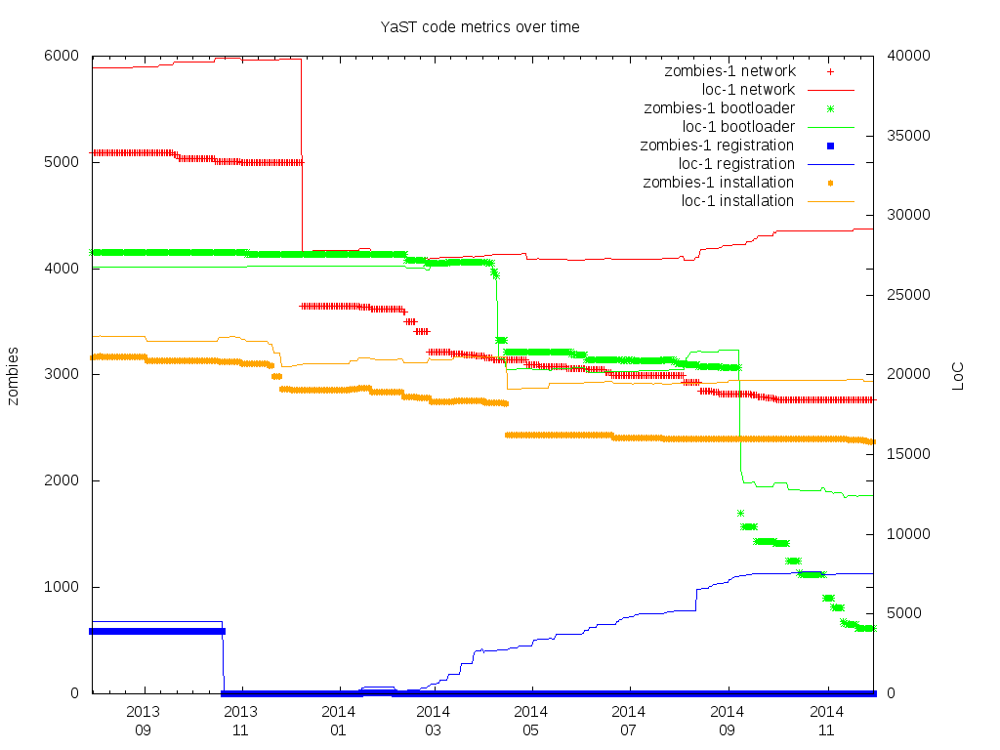

metrics
=======

For [YaST](https://github.com/yast), gather code metrics and plot time series graphs.

Metrics so far:

- loc-1: Lines of Code of *.rb files
- zombies-1: Count of [Zombies](https://github.com/yast/zombie-killer), or `Builtins.*` or `Ops.*` calls

Requirements
------------

- gnuplot
- sqlite

Screenshots
-----------

